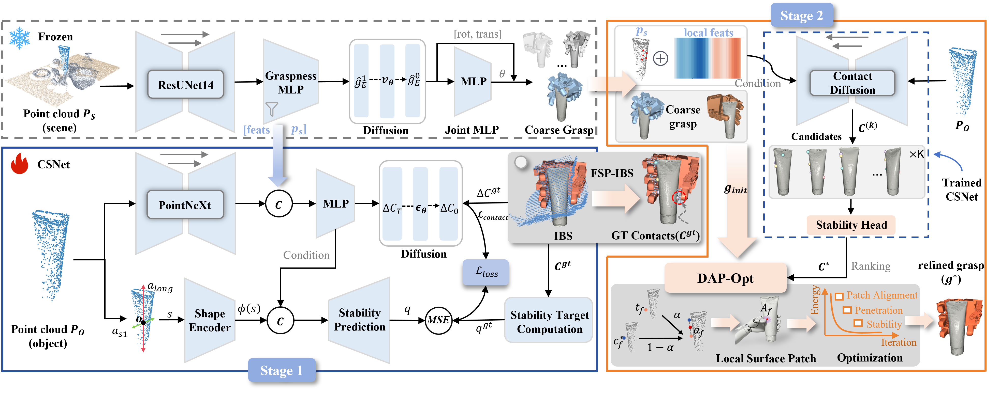

# From Feasible Contacts to Stable Grasps: Stability-Aware Dexterous Grasping in Cluttered Scenes

<p align="center">
  
</p>

## Introduction

This repository contains the official implementation of **StaConGrasp**, a stability-aware dexterous grasping pipeline for cluttered scenes. The released code covers the full experimental workflow:

1. generate **FSP-IBS** contact supervision from IBS voxels;
2. train **CSNet** (Contact–Stability Network) with contact diffusion pretraining followed by joint contact–stability learning;
3. run grasp **prediction** (coarse grasp → contact selection → DAP-Opt refinement) and Isaac Gym **evaluation**.

The public prediction entry is `stacongrasp.adapters.predict_stacongrasp`.

---

## Getting Started

StaConGrasp shares the same core runtime stack as [CADGrasp](https://github.com/matthewmzy/CADGrasp) / DexGraspNet 2.0. We recommend creating a dedicated conda environment with Python 3.8.

### 1. Create conda environment

```bash
conda create -n stacongrasp python=3.8
conda activate stacongrasp
```

### 2. Install PyTorch

```bash
pip install torch torchvision torchaudio --index-url https://download.pytorch.org/whl/cu121
```

### 3. Install Python dependencies

```bash
pip install numpy scipy tqdm termcolor rich pillow pyyaml einops diffusers trimesh open3d plotly
```

### 4. Install PyTorch3D

```bash
# Option 1: conda (recommended)
conda install pytorch3d -c pytorch3d

# Option 2: build from source
pip install "git+https://github.com/facebookresearch/pytorch3d.git@stable"
```

### 5. Install MinkowskiEngine / TorchSDF / torchprimitivesdf

These packages require CUDA builds. Follow the CADGrasp installation guide for the corresponding `thirdparty` builds (set `CUDA_HOME` correctly and use `--no-build-isolation`).

### 6. Data & checkpoints

- Download DexGraspNet 2.0 data / teacher checkpoints (same layout as CADGrasp).
- Ensure IBS voxels are available under `/data/ibsdata` (see CADGrasp IBS preprocessing) before generating FSP-IBS.

All commands below assume you run from the repository root with:

```bash
export PYTHONPATH=src
```

---

## Generate FSP-IBS Supervision

FSP-IBS contact ground truth is built from IBS voxels by thumb/non-thumb split assignment and projection onto the object surface. Precompute the cache used by CSNet training:

```bash
PYTHONPATH=src python -m preprocess.precompute_contact_gt_ibs_thumb_split_cache \
  --scene_range 0 100 \
  --ibs_root /data/ibsdata \
  --cache_root /data/contact_gt_cache \
  --dex_grasps_root /data/dex_grasps_new \
  --fps_root /data/fps_sampled_indices \
  --scenes_root /data/scenes \
  --mesh_root /data/meshdata \
  --device cuda:0 \
  --skip_existing 1
```

---

## Train CSNet

CSNet training has two stages: contact diffusion pretraining, then joint contact–stability training.

### Stage A — Contact diffusion

```bash
PYTHONPATH=src python src/train_stacongrasp_pointnext_offset.py \
  --stage diffusion \
  --yaml configs/network/train_contact_diffusion.yaml \
  --ckpt /data/DexGraspNet2.0-ckpts/OURS/ckpt/ckpt_50000.pth \
  --contact_gt_cache /data/contact_gt_cache \
  --batch_size 8 \
  --iter 5000 \
  --exp_name contact_diffusion
```

### Stage B — Contact–Stability (CSNet)

```bash
PYTHONPATH=src python src/train_stacongrasp_pointnext_offset.py \
  --stage stability \
  --yaml configs/network/train_contact_stability.yaml \
  --ckpt /data/DexGraspNet2.0-ckpts/OURS/ckpt/ckpt_50000.pth \
  --contact_v2_ckpt experiments/contact_diffusion/ckpt/ckpt_5000.pth \
  --contact_gt_cache /data/contact_gt_cache \
  --batch_size 8 \
  --iter 5000 \
  --exp_name contact_stability
```

Checkpoints are written under `experiments/<exp_name>/ckpt/`.

---

## Run Prediction

### Single scene (recommended entry)

```bash
PYTHONPATH=src python -m stacongrasp.adapters.predict_stacongrasp \
  --ckpt_path /data/DexGraspNet2.0-ckpts/OURS/ckpt/ckpt_50000.pth \
  --contact_stability_ckpt experiments/contact_stability/ckpt/ckpt_1000.pth \
  --contact_v2_ckpt experiments/contact_diffusion/ckpt/ckpt_1000.pth \
  --scene_id scene_0113 \
  --scene_num 1 \
  --top_n 5 \
  --contact_num_samples 5 \
  --data_root /data \
  --mesh_root /data/meshdata \
  --result_subdir results_stacongrasp
```

This runs coarse grasp generation → CSNet contact sampling / ranking (\(C^*\)) → DAP-Opt refinement, and saves `grasps.npz` under the experiment result directory.

### Batch prediction (GraspNet dense)

```bash
PYTHONPATH=src python -m eval.predict_stacongrasp_all_pointnext \
  --ckpt_path /data/DexGraspNet2.0-ckpts/OURS/ckpt/ckpt_50000.pth \
  --contact_stability_ckpt experiments/contact_stability/ckpt/ckpt_1000.pth \
  --contact_v2_ckpt experiments/contact_diffusion/ckpt/ckpt_1000.pth \
  --pythonpath src \
  --gpu_list 0 \
  --dataset graspnet \
  --scene_id_start 100 \
  --scene_id_end 190 \
  --top_n 5 \
  --contact_num_samples 5 \
  --data_root /data \
  --mesh_root /data/meshdata \
  --result_subdir results_stacongrasp \
  --overwrite 1
```

---

## Evaluation

### Isaac Gym simulation

```bash
PYTHONPATH=src python -m eval.evaluate_dexterous_all_sdf \
  --ckpt_path_list /data/DexGraspNet2.0-ckpts/OURS/ckpt/ckpt_50000.pth \
  --gpu_list 0 \
  --dataset graspnet \
  --split dense \
  --mesh_root /data/meshdata \
  --result_subdir results_stacongrasp \
  --batch_size 32 \
  --overwrite 1
```

Single-scene evaluation:

```bash
PYTHONPATH=src python -m eval.evaluate_dexterous_sdf \
  --ckpt_path_list /data/DexGraspNet2.0-ckpts/OURS/ckpt/ckpt_50000.pth \
  --scene_id scene_0113 \
  --dataset graspnet \
  --mesh_root /data/meshdata \
  --result_subdir results_stacongrasp \
  --overwrite 1
```

### Print success rates

```bash
PYTHONPATH=src python -m eval.print_results \
  --ckpt_path /data/DexGraspNet2.0-ckpts/OURS/ckpt/ckpt_50000.pth \
  --result_subdir results_stacongrasp \
  --dataset graspnet \
  --split dense
```

---

## Experiments & Reproducibility

The provided code and resources allow for the full reproduction of the results reported in the paper. By using the scripts in this repository and the provided model checkpoints, you can verify the performance of StaConGrasp on GraspNet / ACRONYM evaluation splits.

## Contributing

Contributions are welcome! Please feel free to submit Issues and Pull Requests to improve this project.

## Contact

For any questions regarding the code or dataset, please submit an Issue in this repository.

## Acknowledgments

We thank all researchers and developers who have contributed to this project, and acknowledge related open-source efforts including CADGrasp and DexGraspNet 2.0.
